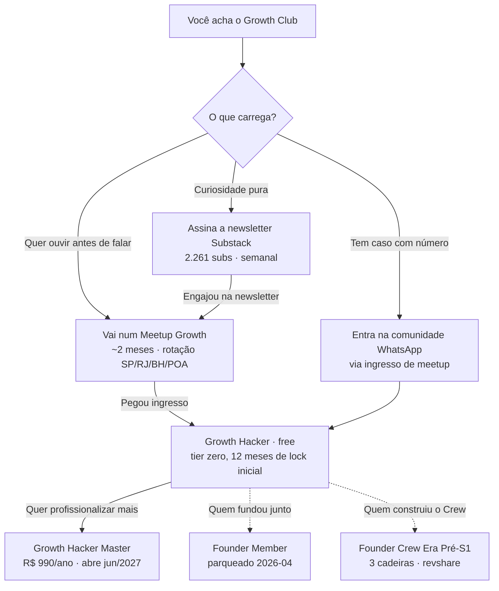
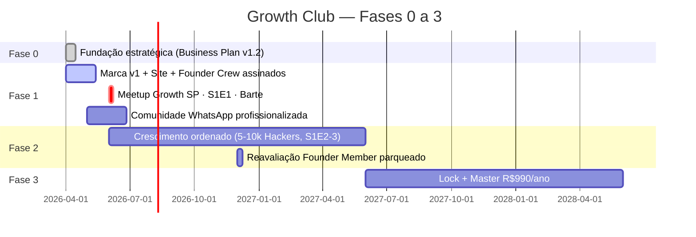

<div align="center">

# Growth Club

### Mesa de canto de um pub.<br>Growth de verdade. Stack de verdade. Sem teatro.

<br>

A maior comunidade multidisciplinar de Growth B2B do Brasil, desde 2015.

<br>

[](https://brgrowthclub.substack.com)
[](#como-sentar-na-mesa)
[](#a-bandeira)
[](#meetup-growth-sp--s1--e1--barte)

<br>

Operadores de marketing, vendas, sucesso de clientes, analytics, produtos e founders.<br>
Do CEO ao dev. Do growth ao quebrado.

<br>

[Assinar a newsletter (free, semanal)](https://brgrowthclub.substack.com) · [Próximo meetup](#meetup-growth-sp--s1--e1--barte) · [Founder Crew aberto](#founder-crew--3-cadeiras-abertas-era-pré-s1)

</div>

---

> Para onde olhar primeiro, conforme quem é você:<br>
> [Membro novo (chegou agora) →](docs/community/start-here.md) ·
> [Investidor →](docs/investors/) ·
> [Patrocinador →](docs/sponsors/) ·
> [Quero ser Founder Crew →](docs/crew/founder-crew-faq.md) ·
> [Build in public →](CHANGELOG.md)

---

## A bandeira

> Aqui não tem grupo fake, vitrine de LinkedIn ou palco de pitch.
>
> O Growth Club é a mesa especial de canto de um pub. A mesa que você olha e pensa: *"aquela galera ali sabe o que faz."* Não porque postou 10 prompts no LinkedIn hoje. Porque carregou meta na semana passada, com ou sem IA, com ou sem stack moderno.
>
> Aqui senta todo mundo: do CEO ao dev, do growth ao quebrado. Founder construindo do zero. CRO comandando operação de R$ 100M. Data scientist que automatizou o outbound. CS que virou máquina de retenção. Se você carrega responsabilidade por crescer alguma coisa, tem um lugar na mesa.
>
> A regra é uma: caso apresentado aqui vem com número. CAC, LTV, MQL, pipeline, receita, ciclo, retenção, o que for. Post sem número vira redirecionamento cordial: *"bota o dado que isso moveu, aí vira thread."*

> [!NOTE]
> **Régua editorial nº 1.** *Se não tem número, não é Growth Club.* Vale dentro do clube, nos meetups, na newsletter, neste repositório.

---

## Quem fundou

Henrique Caner é operador de Growth B2B e fundou a Level Tech.

- Newsletter no Substack desde 2019, com 2.261 assinantes.
- 10+ Meetups Growth organizados e curados na rua desde 2015 (`Era Pré-S1`).
- Workshops high-ticket de IA aplicada a operações de growth: `AI LIKE A PRO by Growth Club`.
- Histórico em operações B2B brasileiras carregando meta com IA, automação e ferramentas modernas.

[LinkedIn](https://linkedin.com/in/henriquecaner) · [Newsletter](https://brgrowthclub.substack.com)

> Última atividade pública: o [CHANGELOG.md](CHANGELOG.md) tem o log de decisões e execuções da comunidade (build-in-public). Pra ler conteúdo recente, vai na [Substack](https://brgrowthclub.substack.com).

---

## O que tá na mesa

| Ativo | Cadência | Ticket |
|---|---|---|
| Newsletter no Substack | Semanal pública. Quinzenal deep (paga, Fase 3). | Free |
| Comunidade no WhatsApp | Contínua, com régua editorial S1. | Free + ingresso de meetup |
| Meetup Growth presencial | A cada ~2 meses, rotação por cidades (SP/RJ/BH/POA). | Pago, valor por edição |
| Livecast semanal | Toda semana, patrocinado. | Free, aberto |
| Workshops high-ticket | 2-4× por ano (formato `AI LIKE A PRO by Growth Club`). | Pago, valor cheio |
| Growth Hacker Master | Tier pago recorrente. Abre na Fase 3 (jun/2027). | R$ 990/ano |
| Founder Member | Cota única de 100, 3 anos pré-pagos. Parqueado em 2026-04. | R$ 2.079 (na retomada) |

---

## Meetup Growth SP · S1 · E1 · Barte

Quando: 1ª ou 2ª semana de junho/2026.<br>
Onde: Barte, São Paulo.<br>
Tema: Revenue Operations com IA. Não o que você viu no LinkedIn, o que tá rodando em pipeline real.<br>
Quem senta na mesa: quem entrega na semana.

> Ingresso vem com membership `Growth Hacker` (tier free do clube), acesso à comunidade WhatsApp e lugar no jantar pós-meetup. Acesso é pago em lote, valor anunciado na convocação da fila.

### Entrar na lista de espera

🍺 [Lista de espera (Tally form)](https://tally.so/r/BzLJO4)

Como funciona: capacidade limitada da Barte. Cadastros entram em fila por ordem. Quando lote abrir, você é convocado pela posição na lista (e-mail e WhatsApp) e tem 48h pra confirmar e pagar. Quem entra antes pega lote mais barato.

> Site oficial `growthclub.pro` em construção pela Founder Crew (vide abaixo). A lista de espera roda no Tally enquanto o site não sobe.

---

## Founder Crew · 3 cadeiras abertas (Era Pré-S1)

> [!IMPORTANT]
> Estamos profissionalizando o Growth Club agora. Quem põe a mão na massa pra esse barco sair do porto pega cadeira de Founder Crew, categoria Era Pré-S1, com revshare e crédito permanente no brand book.

O que tá na mesa pra Founder Crew:

- 10% do líquido da comunidade cada um (30% dividido pelos 3, enquanto Crew ativo).
- Crédito ativo no brand book da Era Pré-S1.
- Vínculo de 3 anos, condicional a entrega upfront (90 dias) e manutenção leve (6h/mês).
- First-pass em vaga paga quando virar contratação fixa.
- Transparência financeira radical: DRE da comunidade fechada todo mês com você na mesa.

### As 3 cadeiras

<table>
<tr>
<td valign="top" width="33%">

#### 1. Frontend (vibe coder)

Põe de pé `growthclub.pro`:
- Captura e thank-you.
- Landing dos meetups parametrizada.
- Integração leve com automação de membership.

Stack à sua escolha. Entrega rápido, sem esperar design system pronto.

</td>
<td valign="top" width="33%">

#### 2. Designer + vídeo

Aplica a identidade nos templates:
- Newsletter, LinkedIn, e-mail.
- Banners de meetup.
- Cortes editoriais do livecast (vertical, 30-90s, 2 cortes/edição).

Identidade já existe (`brand/visual/`). Falta encarnar nos canais.

</td>
<td valign="top" width="34%">

#### 3. Community manager / GitHub

Profissionaliza este repo:
- README master de venda.
- Issues e Discussions estruturados.
- GitHub Actions úteis.
- Estratégia de visibilidade orgânica.

Meta: ≥10 stars até Barte S1E1, ≥50 stars no ano 1.

</td>
</tr>
</table>

> Termos completos: [`STATE.md` · AD-002](.specs/project/STATE.md). Quem topa, manda DM no LinkedIn ([@henriquecaner](https://linkedin.com/in/henriquecaner)).

---

## Como sentar na mesa



| Tier | Quem é | O que paga | Status |
|---|---|---|---|
| Growth Hacker | Qualquer um que vier por meetup ou newsletter. | Free (12 meses de lock pros 1.000 primeiros). | Aberto |
| Founder Crew | Operadores que construíram a Era Pré-S1 com mão na massa. | Não paga, recebe revshare. | 3 vagas abertas |
| Growth Hacker Master | Quem quer profissionalizar mais (premium pago recorrente). | R$ 990/ano (early R$ 690). | Abre jun/2027 |
| Founder Member | Cota única de 100, 3 anos pré-pagos. | R$ 2.079. | Parqueado até retomada |

---

## Roadmap pública



Detalhe completo: [`ROADMAP.md`](.specs/project/ROADMAP.md). Decisões: [`STATE.md`](.specs/project/STATE.md).

---

## Régua editorial pública

Cinco regras que valem dentro do clube e neste repositório:

1. *Se não tem número, não é Growth Club.* Caso, claim, promessa, tudo com evidência. Post ou issue sem número vira redirecionamento cordial.
2. Toda discussão começa por quem operou. Teoria sem operação é ChatGPT, e a gente já tem no bolso.
3. Stack é meio, não fim. Print de Cursor sem output de negócio não vira thread aqui.
4. Atacar padrão é OK. Atacar pessoa nominal, nunca. Desagradável com carinho, com ideia, não com gente.
5. Sem "evento" sozinho. A palavra sempre vem com "comunidade" e marca. Princípio da casa: queremos a maior comunidade, não o maior evento.

Detalhe: [`brand/voice/dos-and-donts.md`](brand/voice/dos-and-donts.md) · [`.specs/project/CONVENTIONS.md`](.specs/project/CONVENTIONS.md).

---

## O que tem aqui dentro

```text
Growth-Club/
├── README.md                          ← você está aqui
├── .specs/project/                    ← decisões públicas (STATE, ROADMAP, STACK, CONVENTIONS)
├── brand/                             ← marca em construção
│   ├── decisions/                     ← bandeira-pirata, nome canônico, arquétipo, marcas-filhas
│   ├── visual/                        ← paleta, tipografia, logo direction
│   ├── voice/                         ← manifesto (3 versões), do's and don'ts, tom por canal
│   ├── templates/                     ← (em construção pela Founder Crew #2)
│   └── brand-book.md                  ← consolidação viva
├── docs/superpowers/specs/            ← Business Plan v1.2 (aprovado, 2026-04-22)
├── docs/superpowers/plans/            ← Brand Brief Plan v1.2 (aprovado)
├── docs/community/                    ← estratégia de visibilidade, playbooks v0
├── website/                           ← (em construção pela Founder Crew #1)
└── .github/                           ← issue templates, código de conduta, contribuição
```

Por que tá tudo aberto: transparência radical (decisão registrada em [`STATE.md` AD-005](.specs/project/STATE.md)). Mostrar como o sausage é feito é o que o clube prega. Único arquivo escondido: contratos financeiros (`docs/contracts/`).

---

## Bandeira (créditos)

Growth Club é operado dentro do CNPJ da [Level Tech](https://leveltech.com.br) em Fase 1, com plano de spin-off pra CNPJ próprio quando atingir maturidade financeira (gatilhos em [`STATE.md` AD-004](.specs/project/STATE.md)).

Quem fundou: [Henrique Caner](https://linkedin.com/in/henriquecaner). Solo desde 2015, agora abrindo cadeiras.

Founder Crew (Era Pré-S1): 3 cadeiras abertas, em recrutamento.

Founder Members (Era Pré-S1): parqueado até retomada.

---

## Quero contribuir

- Tem caso com número pra compartilhar? [Abre uma Discussion](https://github.com/) na categoria `Show & Number`.
- Quer sugerir pauta de meetup? [Issue template aqui](.github/ISSUE_TEMPLATE/sugestao-pauta-meetup.yml).
- Achou bug no site `growthclub.pro`? [Issue template aqui](.github/ISSUE_TEMPLATE/bug-site.yml) (assim que o site subir).
- Quer mexer em template de marca? Lê o [CONTRIBUTING](.github/CONTRIBUTING.md) primeiro. O pacto editorial é radical.
- Topa uma das 3 cadeiras de Founder Crew? DM no [LinkedIn do Henrique](https://linkedin.com/in/henriquecaner).

Antes de qualquer contribuição: leia o [CODE_OF_CONDUCT](.github/CODE_OF_CONDUCT.md). É o pacto editorial transformado em código de conduta, e a régua é:

> *Franco, com número, sem palco, com cerveja.*

---

## Star history

[](https://star-history.com/#growthclub-pro/Growth-Club)

> *Se você chegou até aqui, dá uma star. É o equivalente moderno de levantar a caneca pra mesa do canto.*

---

<div align="center">

Growth Club. Comunidade brasileira de operadores de Growth B2B desde 2015.<br>
[`growthclub.pro`](https://growthclub.pro) · [Newsletter](https://brgrowthclub.substack.com) · [LinkedIn do Henrique](https://linkedin.com/in/henriquecaner)

*Mesa de canto de um pub. Growth de verdade. Stack de verdade. Sem teatro.*

</div>
